# Model Evasion Attack on Intrusion Detection Systems using Adversarial Machine Learning

<br>

Reporter:
- **Nguyễn Mỹ Quỳnh** <br>
- **Trần Huỳnh Quốc Đạt** <br>
  
[Link Drive](https://drive.google.com/drive/folders/1FoztT_7gsmDDHG45Gqvx1D1yNJfXC-te?usp=sharing)<br>
</br>

## Kết quả bài báo tham khảo 
*Hình 1. Hiệu suất model trên tập test không chứa AE*
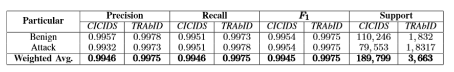
<br>
</br>
*Hình 2. So sánh hiệu suất model trên tập test chứa và không chứa AE*
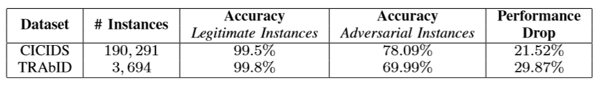

## Kết quả của nhóm  
1. TRAbID_Dataset 
 - Hiệu suất model trên tập test không chứa AE

```
              precision    recall  f1-score   support

           0     0.9978    0.9951    0.9964      1832
           1     0.9951    0.9978    0.9965      1831

    accuracy                         0.9965      3663
   macro avg     0.9965    0.9965    0.9965      3663
weighted avg     0.9965    0.9965    0.9965      3663

Confusion Matrix:
 [[1823    9]
 [   4 1827]]


Accuracy:  0.9964509964509964
F1:  0.9964548677392965
Precison:  0.9950980392156863
Recall:  0.997815401419989
```

<br>
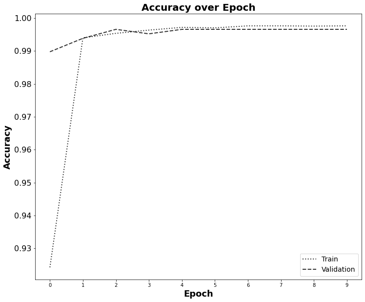
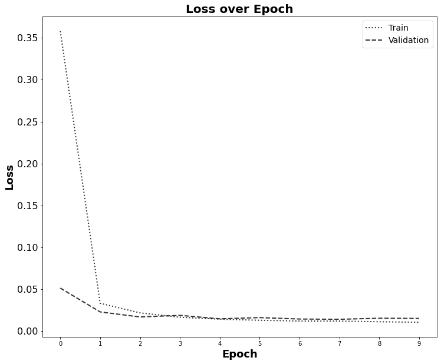


<br>

 - Hiệu suất model trên tập test chứa AE

```        
           precision    recall  f1-score   support

           0     0.0000    0.0000    0.0000      1832
           1     0.4993    0.9978    0.6656      1831

    accuracy                         0.4988      3663
   macro avg     0.2497    0.4989    0.3328      3663
weighted avg     0.2496    0.4988    0.3327      3663

Confusion Matrix:
 [[   0 1832]
 [   4 1827]]

Accuracy:  0.4987714987714988
F1:  0.6655737704918033
Precison:  0.4993167532112599
Recall:  0.997815401419989
```

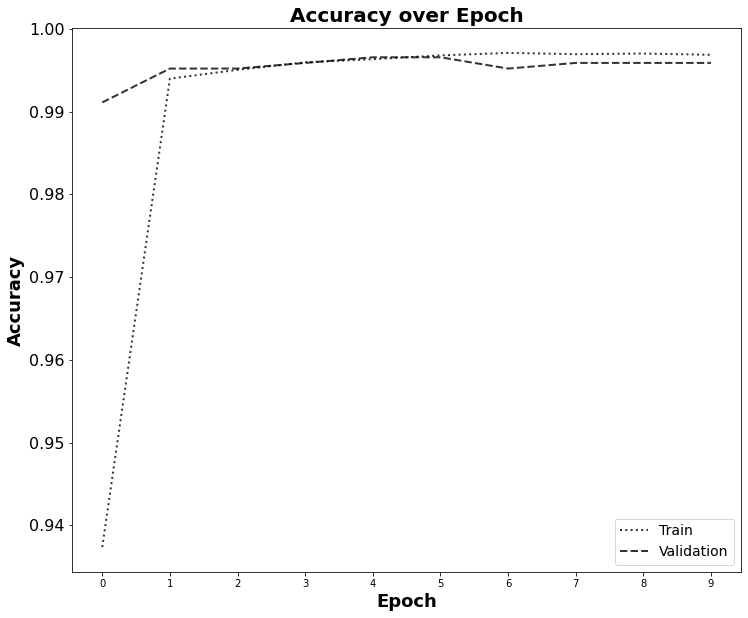
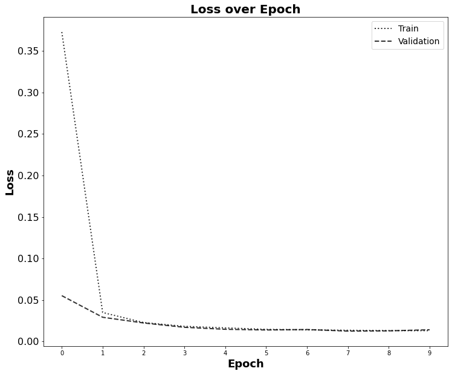
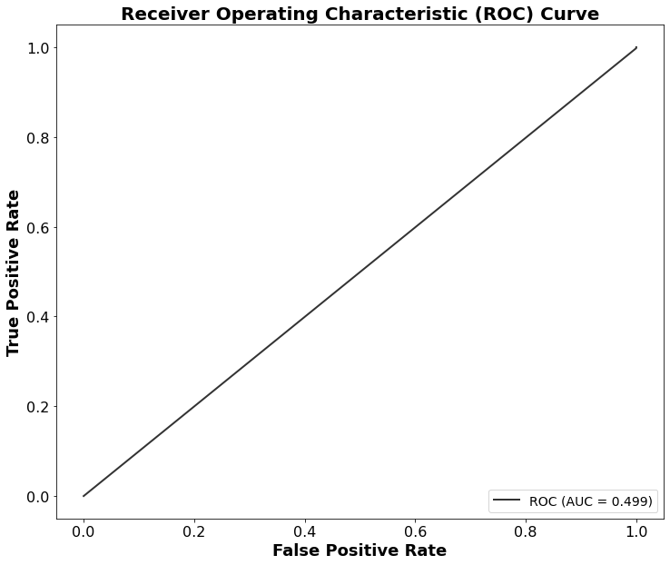

<br>
</br>

> _**Nhận xét:** Khi đánh giá model với tập test có chứa AE, độ chính xác giảm từ 99.65% xuống còn 49.88%._

<br>
</br>

1. CICIDS2017_Dataset 
 - Hiệu suất model trên tập test không chứa AE

```
              precision    recall  f1-score   support

           0     0.9850    0.9666    0.9757      2844
           1     0.9766    0.9895    0.9830      4000

    accuracy                         0.9800      6844
   macro avg     0.9808    0.9780    0.9793      6844
weighted avg     0.9800    0.9800    0.9800      6844

Confusion Matrix:
 [[2749   95]
 [  42 3958]]

Accuracy:  0.9799824663939217
F1:  0.9829877064448032

Precison:  0.9765605724154947
Recall:  0.9895
```

<br>
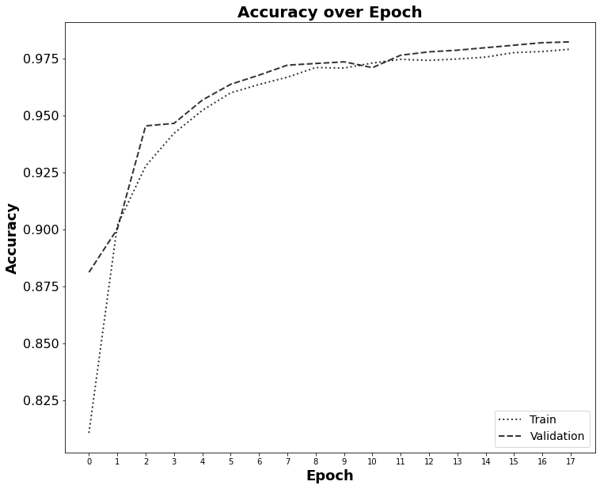
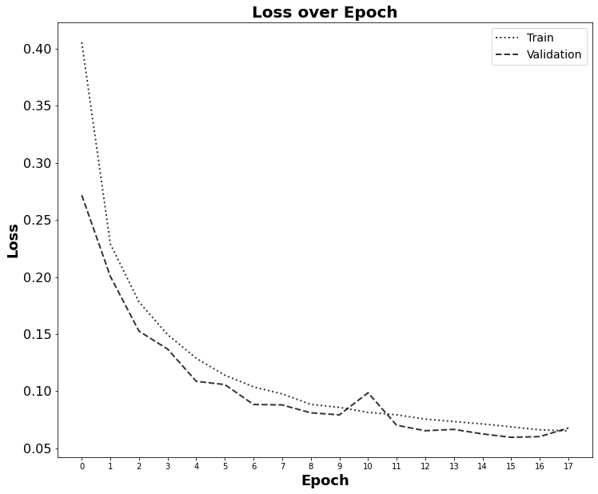
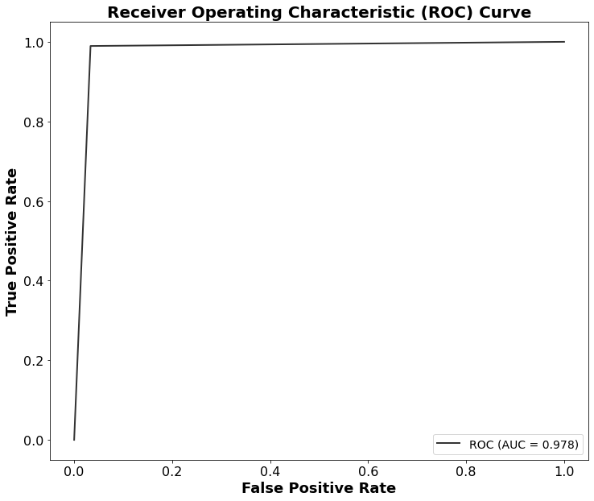


<br>

 - Hiệu suất model trên tập test chứa AE

```        
           precision    recall  f1-score   support

           0     0.0000    0.0000    0.0000      2844
           1     0.5819    0.9895    0.7328      4000

    accuracy                         0.5783      6844
   macro avg     0.2909    0.4948    0.3664      6844
weighted avg     0.3401    0.5783    0.4283      6844

Confusion Matrix:
 [[   0 2844]
 [  42 3958]]

Accuracy:  0.5783167738164816
F1:  0.7328272542121829
Precison:  0.58188768009409
Recall:  0.9895
```


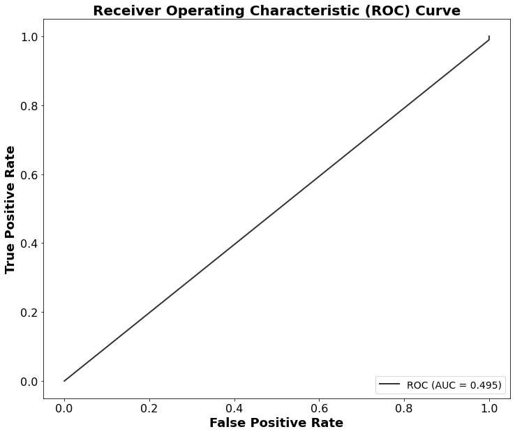

<br>
</br>

> _**Nhận xét:** Khi đánh giá model với tập test có chứa AE, độ chính xác giảm từ 98% xuống còn 57.83%._


